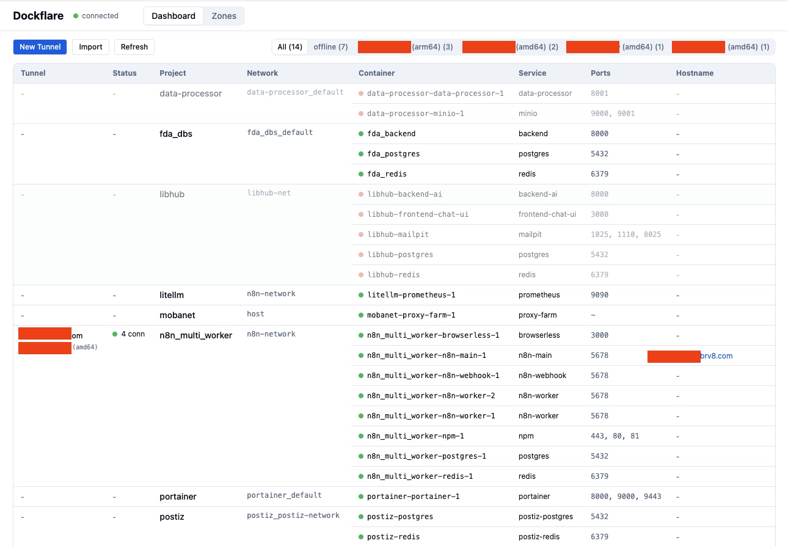

# Dockflare

**A self-hosted management plane for Cloudflare Tunnels.**

One dashboard to manage all your tunnels, routes, and cloudflared sidecars across Docker Compose projects — replacing scattered `.env` tokens and per-project cloudflared services.



## Why

If you run multiple projects on a VPS with Cloudflare Tunnels, you probably have this:

```
project-a/
  docker-compose.yml    # has a cloudflared service
  .env                  # has TUNNEL_TOKEN=eyJ...

project-b/
  docker-compose.yml    # has another cloudflared service
  .env                  # has another TUNNEL_TOKEN=eyJ...

project-c/
  ...same pattern...
```

Every new hostname means editing ingress YAML, every new project means creating a tunnel in the CF dashboard, copying tokens, and restarting stacks. Token rotation? Manual across every project.

**Dockflare replaces all of that:**

- One UI to see all tunnels, routes, containers, and their connections
- Create, edit, delete, and recreate tunnels without touching compose files
- Edit ingress routes with a service picker that shows your running Docker containers
- Export/import tunnel configs for backup and migration
- One-click recreate (token rotation) — same name, same routes, fresh token
- Filter tunnels by machine (IP + architecture) when managing multiple servers
- Remove `cloudflared` from your compose files — Dockflare manages sidecars for you

## Quick Start

### Prerequisites

- A VPS/server running Docker with your projects
- Python 3.12+
- Node.js 20+
- A Cloudflare account with at least one zone

### 1. Create a Cloudflare API Token

Go to [Cloudflare API Tokens](https://dash.cloudflare.com/profile/api-tokens) and create a **Custom Token** with these permissions:

| Scope | Resource | Access |
|---|---|---|
| Cloudflare Tunnel | Account | Edit |
| DNS | Zone | Edit |
| Zone | Zone | Read |
| Zone Settings | Zone | Read |
| Account Settings | Account | Read |

Set **Account Resources** to your account and **Zone Resources** to "All zones" (or specific zones).

### 2. Clone and Install

```bash
git clone https://github.com/yourusername/dockflare.git
cd dockflare

# Backend
uv venv .venv
source .venv/bin/activate
uv pip install -e ".[dev]"

# Frontend
cd frontend
npm install
cd ..
```

### 3. Configure

Create a `.env` file in the project root:

```
CF_TOKEN=your_cloudflare_api_token_here
```

### 4. Run

In two terminals:

```bash
# Terminal 1: Backend
source .venv/bin/activate
cd backend
uvicorn app.main:app --host 0.0.0.0 --port 8088 --reload --reload-dir app

# Terminal 2: Frontend
cd frontend
npm run dev
```

Open **http://your-server-ip:5173** in your browser.

### 5. What You'll See

The dashboard shows:

- **All your CF tunnels** with connection status, origin IP, and machine identifier
- **All Docker Compose projects** with their containers, services, ports, and networks
- **Route mappings** — which hostname points to which container/service
- **Machine filter** — filter tunnels by server (distinguishes by IP + architecture)

### 6. Managing Tunnels

**Adopting existing tunnels:** Your current tunnels appear automatically. To have Dockflare manage a tunnel's sidecar, remove `cloudflared` from that project's `docker-compose.yml` and use the "Recreate" button — Dockflare will spawn and manage the sidecar.

**Creating new tunnels:** Click "New Tunnel", specify a name and optionally a target compose project/service.

**Editing routes:** Click "Edit" on a tunnel to modify its ingress rules. The service picker dropdown shows all running Docker containers with their ports.

**Token rotation:** Click "Recreate" — this exports the config, deletes the old tunnel, creates a new one with the same routes, updates DNS, and spawns a new sidecar. Brief downtime during the switch.

**Backup/migration:** "Export" downloads a JSON config. "Import" creates a new tunnel from that config. Use this to move tunnels between servers.

## Architecture

```
Browser  -->  Vite (dev) / Static (prod)  -->  FastAPI Backend
                                                   |
                                    +--------------+--------------+
                                    |              |              |
                              Docker API    Cloudflare API    SQLite DB
                              (containers)  (tunnels/DNS)    (state)
```

- **Backend:** Python 3.12, FastAPI, SQLModel, httpx, docker-py
- **Frontend:** React 18, TypeScript, TanStack Query, Tailwind CSS, Vite
- **Database:** SQLite (WAL mode) for tunnel state, audit logs, and caching

## Docker Compose Standard

When Dockflare manages your tunnels, your compose files simplify to just the project services:

```yaml
# Before
services:
  web:
    image: my-app
  cloudflared:              # <-- remove this
    image: cloudflare/cloudflared
    command: tunnel run
    environment:
      TUNNEL_TOKEN: ${CF_TUNNEL_TOKEN}

# After
services:
  web:
    image: my-app
  # cloudflared managed by Dockflare
```

Let Docker Compose create the default network automatically. Dockflare discovers the network and attaches the cloudflared sidecar to it.

## Development

```bash
# Run tests
make test-backend

# Lint
make lint-backend

# Type check
make typecheck-backend

# Format
make format
```

## License

MIT
